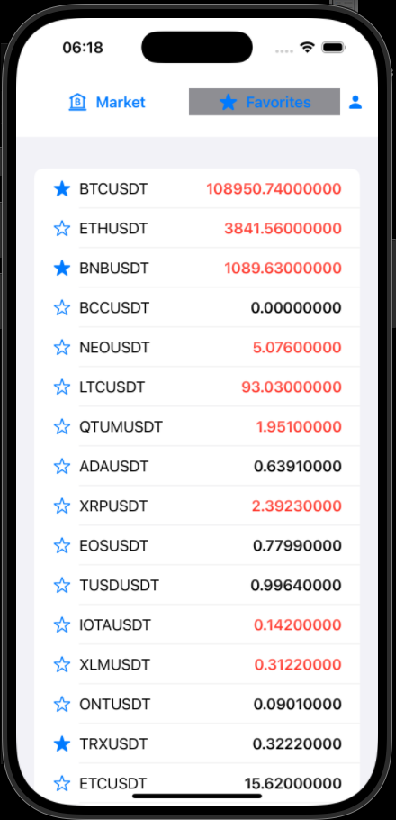
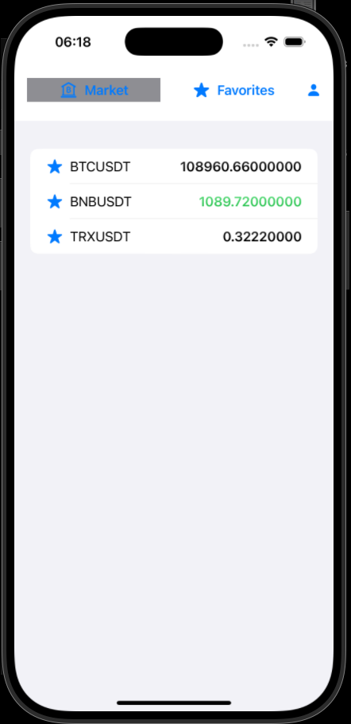
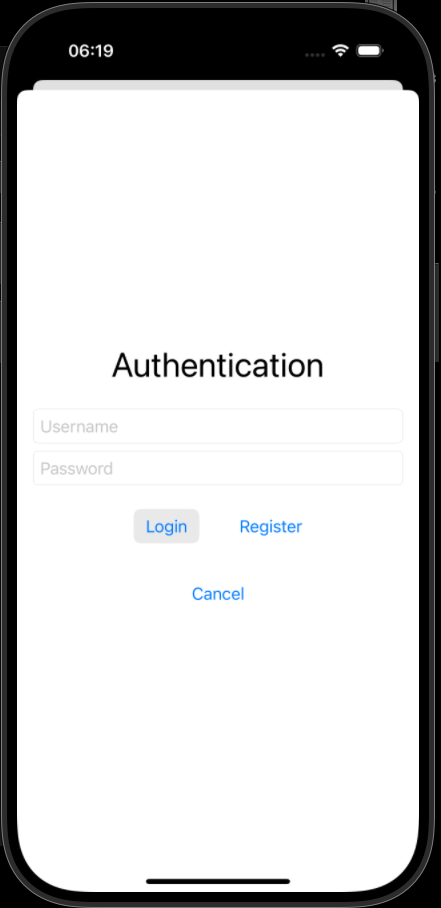

# CryptoChecker 🚀

**CryptoChecker** is a SwiftUI app for tracking cryptocurrency prices in real-time. Users can search for coins, mark favorites, and securely store login credentials using Keychain. The app supports multiple users and keeps favorite coins personalized for each account.

---

## Features ⭐️

- Real-time cryptocurrency price updates
- Search functionality to quickly find coins
- Favorite coins per user account
- Secure login with Keychain storage
- Responsive SwiftUI interface
- Pull-to-refresh and automatic periodic updates

---

## Screenshots 📱




---

## Project Structure 📂
```
CryptoChecker/
├─ Models/               # Data models (CoinModel, CryptoModel)
├─ ViewModels/           # Business logic and network handling
├─ Views/                # SwiftUI views and UI components
├─ Services/             # NetworkService, AuthService (Keychain)
├─ Assets/Screnshots     # Images, icons, and screenshots
└─ Constants
```

---

## Usage 🛠
- Market Tab: View all available cryptocurrencies with live prices
- Favorites Tab: Quickly access your saved favorite coins
- Profile / Login: Sign in to save favorites; credentials are stored securely using Keychain
- Automatic Updates: Prices refresh every few seconds, with visual highlights for price changes

---

## Dependencies ⚡️

- Swift 5+
- iOS 16.6+
- Uses SwiftUI

---
